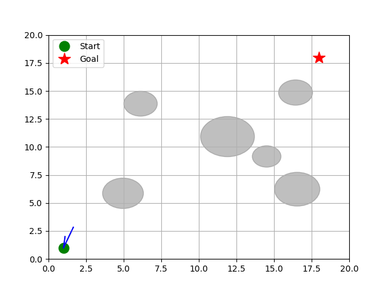
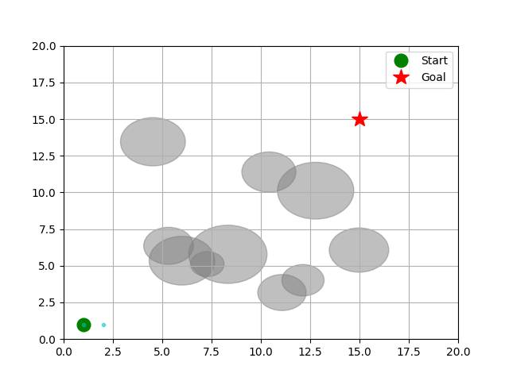

# Motion Planning Algorithms

> Implementation, visualization, and performance comparison of **sampling-based** and **grid-based** motion planning algorithms for **holonomic** and **non-holonomic** robotic systems.

---

## 🚀 Overview

This repository implements and compares **multiple motion planning algorithms**, each in **two variants**:

- **Holonomic version** (free motion in x–y space)
- **Non-holonomic version** (kinematic constraints, e.g., car-like robots)

The main focus of this project is to **analyze performance trade-offs** between the algorithms in terms of:
- Planning time
- Path quality (length & smoothness)
- Suitability for constrained motion systems

Additionally, we now compare **sampling-based methods** (RRT, RRT*) with **grid-based search methods** (Dijkstra, A*, Hybrid A*).

---

## 🧠 Implemented Algorithms

### Sampling-Based Algorithms
- **RRT** (Rapidly-Exploring Random Tree)
- **RRT\*** (Optimal Rapidly-Exploring Random Tree)

### Grid-Based Algorithms
- **Dijkstra**
- **A\***
- **Hybrid A\*** (Non-holonomic motion aware, uses analytical expansions like Dubins paths)

---

## ⚙️ System Types

### 🟢 Holonomic Systems
- Robot can move freely in any direction.
- State: **(x, y)**
- Motion primitives: straight-line interpolation.
- Collision checking is simpler.

### 🚗 Non-Holonomic Systems
- Motion is constrained by kinematics (e.g., car-like robot).
- State: **(x, y, θ)**
- Motion primitives follow feasible trajectories.
- Collision checking is performed along curved paths.

---

## 🔄 Holonomic vs Non-Holonomic Behavior

| Aspect | Holonomic | Non-Holonomic |
|--------|-----------|---------------|
| State Space | (x, y) | (x, y, θ) |
| Motion | Free | Constrained by kinematics |
| Collision Check | Simple | Along feasible trajectory |
| Planning Difficulty | Lower | Higher |
| Path Smoothness | High | Depends on steering |

---

## 🔀 Sampling-Based vs Grid-Based Planning

| Aspect | Sampling-Based (RRT / RRT*) | Grid-Based (Dijkstra / A* / Hybrid A*) |
|--------|-----------------------------|---------------------------------------|
| Exploration | Random, probabilistic | Deterministic, systematic |
| Path Optimality | RRT: suboptimal, RRT*: asymptotically optimal | Dijkstra: optimal, A*: optimal with heuristics, Hybrid A*: optimal with kinematic feasibility |
| Speed | Fast initial solution, slower convergence | Can be slower on large grids but guarantees shortest path |
| Suitability | High-dimensional spaces | Discrete or low-dimensional grid maps |
| Motion Constraints | Easy to integrate via motion primitives | Hybrid A* handles non-holonomic constraints |

---

## 🔍 Algorithm Walkthrough

### 1️⃣ RRT — Rapidly-Exploring Random Tree

**Core Idea:** Quickly explore the configuration space to find *any* feasible path.

**Steps:**
1. Initialize the tree with the start node.
2. Randomly sample a configuration in the space.
3. Find the nearest node in the tree.
4. Steer toward the sampled point:
   - Straight-line motion (holonomic)
   - Feasible kinematic motion (non-holonomic)
5. Check for collisions along the path.
6. Add the new node if collision-free.
7. Repeat until the goal is reached or maximum iterations are exceeded.

---

### 2️⃣ RRT* — Optimal Rapidly-Exploring Random Tree

**Core Idea:** Improve RRT by **optimizing path cost** through selecting the best parent and rewiring neighbors.

**Steps:**
1. Randomly sample a configuration.
2. Find the nearest node.
3. Move toward the sample with step size limit.
4. Identify nearby nodes within a search radius.
5. Choose parent minimizing total cost.
6. Insert the new node.
7. Rewire neighbors if cost improves.
8. Repeat until goal reached or iterations exhausted.

---

### 3️⃣ Dijkstra — Grid-Based Shortest Path

**Core Idea:** Systematically explore nodes with lowest cost from the start to find **shortest path**.

**Steps:**
1. Initialize start node with cost 0.
2. Add start to priority queue.
3. Pop the node with lowest cost.
4. Expand neighbors, updating their costs if lower.
5. Add updated neighbors to the queue.
6. Repeat until goal reached.

**Characteristics:**
- Guarantees shortest path.
- Ignores heuristics (blind search).
- Can be slow on large grids.

---

### 4️⃣ A* — Grid-Based Shortest Path with Heuristic

**Core Idea:** Use **cost-to-come + heuristic estimate** to guide search efficiently.

**Steps:**
1. Initialize start node with cost = 0.
2. Add start to open set.
3. Pop node with lowest `f = g + h` (g: cost so far, h: heuristic).
4. Expand neighbors:
   - Update costs if new path is cheaper
   - Add neighbors to open set
5. Repeat until goal reached.

**Characteristics:**
- Heuristic accelerates search.
- Guarantees shortest path if heuristic is admissible.
- Efficient on large grids.

---

### 5️⃣ Hybrid A* — Non-Holonomic Grid Search

**Core Idea:** Extend A* to **non-holonomic vehicles** using continuous state space and analytical expansions (e.g., Dubins or Reeds-Shepp paths).

**Steps:**
1. Initialize start node with `(x, y, θ)`.
2. Add start node to open set.
3. Pop node with lowest `f = g + h`.
4. Expand using feasible motions (steering & step size).
5. If goal is close, attempt **analytical connection** (Dubins/Reeds-Shepp).
6. Add valid neighbors to open set.
7. Repeat until goal reached.

**Characteristics:**
- Produces kinematically feasible paths.
- Integrates smooth turns and vehicle constraints.
- Slower than classical A* due to motion expansion checks.

---

## 📊 Performance Comparison (with Visual Results)

| Algorithm      | System Type     | Planning Speed     | Path Quality       | Visualization |
|----------------|----------------|------------------|------------------|---------------|
| RRT            | Holonomic       | **⭐⭐⭐⭐** Fast | **⭐⭐** Longer |  |
| RRT            | Non-Holonomic   | **⭐⭐⭐** Medium | **⭐⭐** Longer |  |
| RRT*           | Holonomic       | **⭐⭐** Slower | **⭐⭐⭐⭐** Short |  |
| RRT*           | Non-Holonomic   | **⭐** Slowest | **⭐⭐⭐⭐** Best  |  |
| Dijkstra       | Grid            | **⭐⭐** Moderate | **⭐⭐⭐⭐** Optimal |  |
| A*             | Grid            | **⭐⭐⭐** Fast   | **⭐⭐⭐⭐** Optimal |  |
| Hybrid A*      | Non-Holonomic   | **⭐** Slower  | **⭐⭐⭐⭐** Feasible & smooth |  |

---

## 📈 Key Insights

- **Sampling vs Grid-Based**
  - Sampling: better in high-dimensional, continuous spaces.
  - Grid: better guarantees on optimality and predictability.
- **RRT vs RRT\***
  - RRT finds feasible paths faster.
  - RRT* produces shorter, smoother paths.
- **Dijkstra vs A\***
  - Dijkstra: always finds shortest path, but slower.
  - A*: uses heuristics, faster while maintaining optimality.
- **Hybrid A***
  - Integrates non-holonomic constraints.
  - Smooth feasible paths for car-like robots.
- **Best Use Cases**
  - RRT → fast exploration in continuous spaces.
  - RRT* → optimal planning for complex systems.
  - Dijkstra / A* → grid-based environments.
  - Hybrid A* → autonomous driving, vehicle path planning.

---

